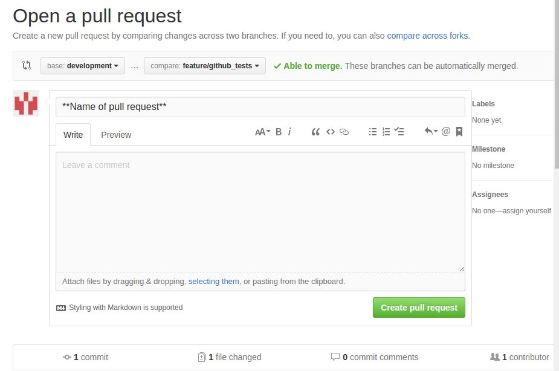

===========
Github test
===========

Vašou úlohou je si urobiť lokálnu branchu z developmentu, vytvoriť nový súbor s určenou funkcionalitou a následne vytvoriť pull request na development. Úloha je splnená pokiaľ Vám danú branchu mergnem, pričom bude spĺňať všetky požiadavky.

""""""""""
Požiadavky
""""""""""

Po spustení musí váš program (pomenovaný *priezvisko*.py) vypísať Vaše celé meno, aktuálny dátum,
absolútnu cestu k programu.

V prípade, že jeden z argumentov bude súbor alebo string (stačí jedna verzia, nepreháňajme to, viem že googliť viete) zmení všetky medzery (' ') na podčiarkovníky ('_').

Funkcionalitu môžete aj definovať pomocou prepínačov (--help -> meno, dátum, cesta, --file/--string/--nieco -> spracovanie textu).

Snažte sa dodržovať PEP8 a základné pravidlá commit messageov (i keď sa to dá vytvoriť všetko na jeden commit - i don't judge, len aby ste si to osvojili)

POZOR: Uvedomil som si, že argumenty v nekonzolovom prostredí, môžu byť problém, akceptujem teda lokálne definovaného stringu alebo načítaného textového súboru. Ak by ste sa chceli sa snažiť rozbehať argumenty pozrite si dokumentácie a posty na stackoverflowe, nemám s tým skúsenosti. Link_.

.. _Link: http://stackoverflow.com/questions/33102272/pycharm-and-sys-argv-arguments

==========
Quick help
==========

Prvým krokom je vytvorenie si vlastnej novej branche z developmentu, do ktorej budete pushovať svoje zmeny a budete sa ju následnej snažiť mergnúť.

Kroky:

1. Nastavenie sa / uistenie sa, že ste na development branch-i = git checkout development
2. Vytvorenie novej branche = git checkout -b tests/<priezvisko>
   Názvoslovie nie je nevyhnutné, ide o prehladnosť, dodám danú metodiku do ďalších častí projektu, aby som vás za to mohol oficiálne karhať.
2. BONUS: Nezabudnite si pushnúť lokálnu branchu (najlepšie čistú, čerstvo vytvorenú), aby ste ju videli aj na stránke. = git push (možno bude treba nastaviť origin a source, doporucujem si nieco o tejto funkcionalite precitat, budete sa vam to hodit aj do buducna, popripade vysvetlim)
3. Práca na úlohe = git status, git diff, git commit (-s), git push su hlavne prikazy.
4. V prípade, ze pouzivate externe kniznice pre python, je dobre si vytvorit virtualne prostredie.
   Nieco o nom som uz spominal, pre nerozsiahlost tejto ulohy to potrebne nebude, no do buducna sa na to pripravte.
5. V prípade, že ste spokojni s funkcionalitou, podla zadania a chceli by ste odovzdat dany subor, skontrolujte si kod podla PEP8 (kniznica ako flake8 to skontroluje za vas).
6. Vytvorte pull request na zaklade návodu nižšie.
7. ???
8. Ocakavajte moju nespokojnost, chodte sa vyplakat do rohu, opravte chyby a vytvorte / obnovte pull request.
9. Pull request schvaleny! Gratulujem! Ocekujte sa na scrumdesku a opiste svoje zle skusenosti do denniku. Pekny vecer.

Pull request si myslím, sa najlepšie rieši cez stránku.

Vidíte base <-> compare (kam <-> odkial), treba napísať čo znázorňuje ten pull request (berie automaticky posledný commit message, môže byť aj to ak je to výstižné) a assignees to určite mňa.

V prípade ďalších otázok mail/slack/fyzicky.

Tento súbor môže byť updatnutý v prípade veľa rovnakých otázok, ďalších informácií.
